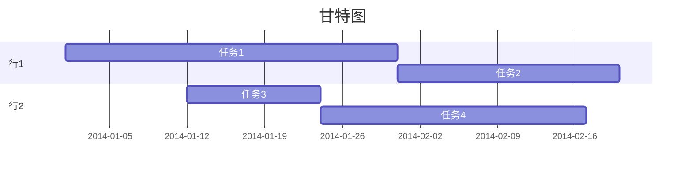
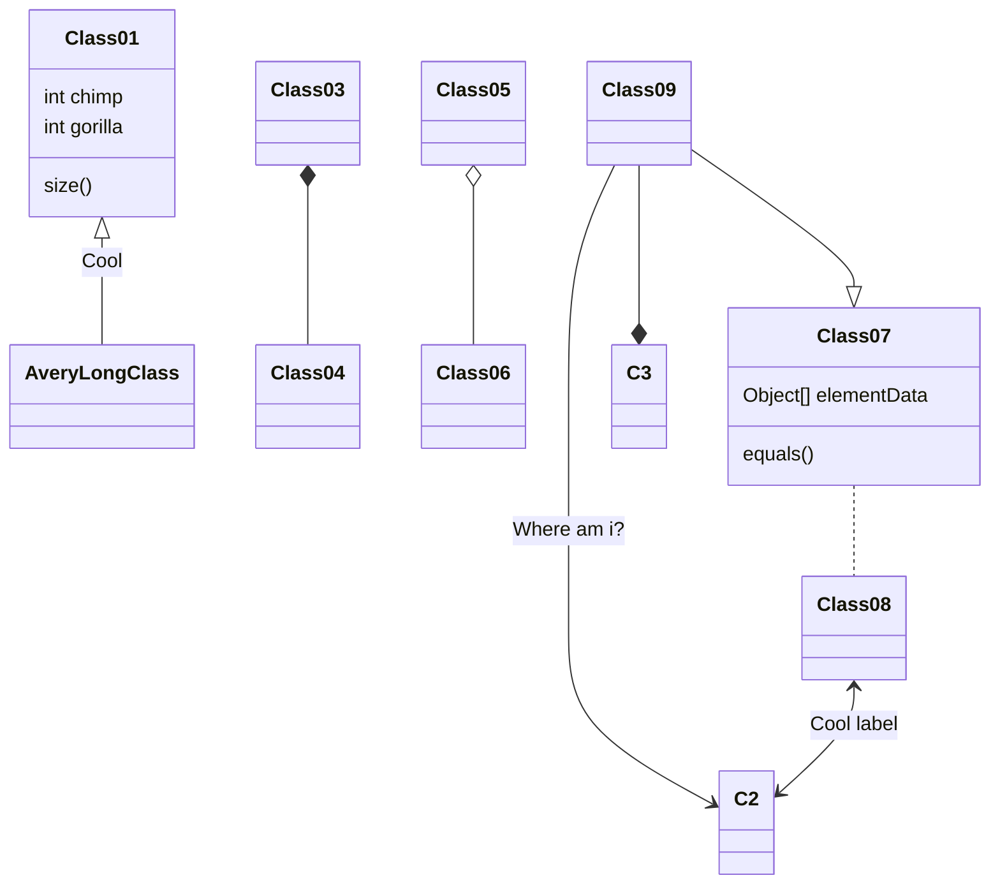

## 流程图
```flow
st=>start: 陪妹子进商场
op=>operation: 买买买
cond=>condition: 妹子开不开心?
e=>end: 出商场
st->op->cond
cond(yes)->e
cond(no)->op
```
## 序列图
```sequence
战士->领导: 首长好 
Note right of 领导: 首长复杂的内心活动
领导-->战士: 同志们好
战士->>领导: 为人民服务
```
## mermaid甘特图

## mermaid类图


### open with vscode

## 上下标

* 上标：${正常内容}^{上标内容}$

* 下标：${正常内容}_{下标内容}$

## 字母头部加帽子
* $\vec{a}$				向量
* $\overline{a}$			平均值
* $\widehat{a}$			(线性回归，直线方程)y尖
* $\dot{a}$				一阶倒数
* $\ddot{a}$				二阶导数
* $\hat{a}$				^帽子命令
* $\tilde{a}$				~帽子命令
* $\check{a}$				倒尖帽子命令
* $\grave{a}$				4声调帽子命令    
* $\acute{a}$				2声调帽子命令
* $\widehat{abcdefg}$		大^帽子命令
* $\widetilde{abcdefg}$	大~帽子命令
