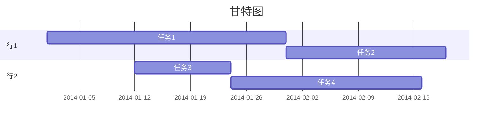
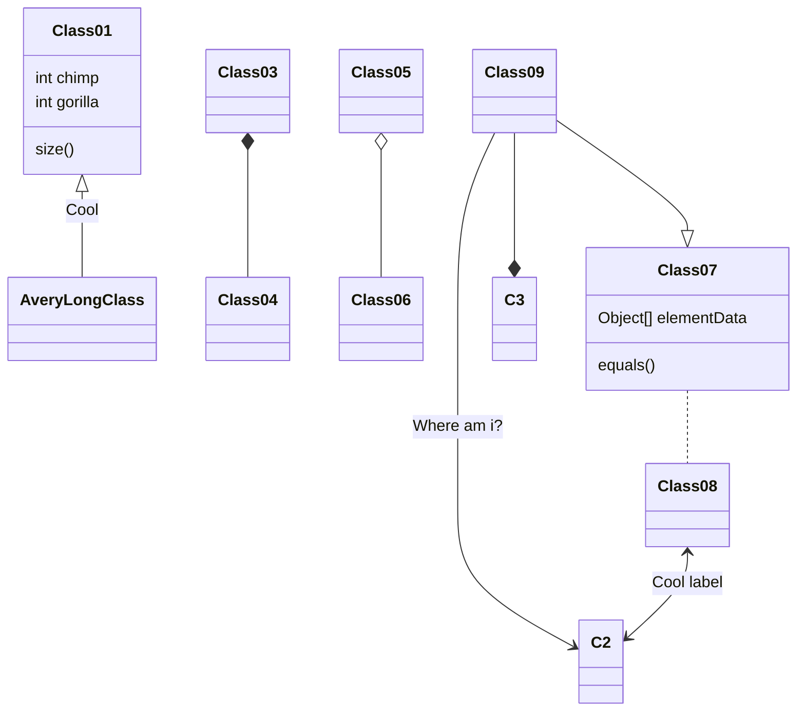

## 流程图
```flow
st=>start: 陪妹子进商场
op=>operation: 买买买
cond=>condition: 妹子开不开心?
e=>end: 出商场
st->op->cond
cond(yes)->e
cond(no)->op
```
## 序列图
```sequence
战士->领导: 首长好 
Note right of 领导: 首长复杂的内心活动
领导-->战士: 同志们好
战士->>领导: 为人民服务
```
## mermaid甘特图

## mermaid类图


### open with vscode